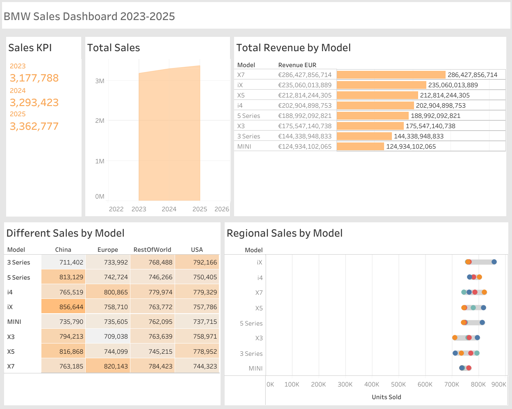

# BMW Sales
# BMW Sales Analysis (2023–2025) – Tableau Dashboard

## Project Overview
This project analyses BMW vehicle sales data from **2023 to 2025** using Tableau.  
The objective was to explore sales trends across models, identify revenue performance, and analyse regional sales differences.

The dashboard provides an overview of total sales performance and highlights how different vehicle models contribute to overall revenue.

This project builds on Tableau skills developed through previous dashboard work and demonstrates more advanced visualisation techniques.

---

## Dashboard
View the interactive dashboard on Tableau Public:

https://public.tableau.com/views/BMWsales_17728495006890/Sales2023-2025?:language=zh-TW&:sid=&:redirect=auth&:display_count=n&:origin=viz_share_link

---

## Business Questions

The analysis focuses on answering the following questions:

- What are the **total sales for each year (2023–2025)**?
- How has **overall sales changed across the three years**?
- Which **BMW models generate the most revenue**?
- How do **sales vary between different models**?
- How do **regional sales differ across vehicle models**?

---

## Dashboard Features

The Tableau dashboard includes the following visualisations:

**Sales KPI Indicators (2023–2025)**  
Displays total sales for each year to quickly track performance.

**Total Sales by Year (Bar Chart)**  
Compares sales trends between 2023, 2024, and 2025.

**Revenue by Model (Clustered Bar Chart)**  
Highlights which BMW models generate the highest revenue.

**Sales by Model (Heat Map)**  
Visual representation showing relative sales intensity across models.

**Regional Sales by Model (Dumbbell Chart)**  
Compares sales performance across regions for each vehicle model.

---

## Key Insights

- Sales performance varies across BMW models.
- Certain models generate significantly higher revenue than others.
- Regional sales patterns highlight market differences in customer preferences.
- Multi-year analysis helps identify sales trends and model performance over time.

---

## Business Recommendations

The analysis suggests several opportunities to improve sales performance:

• High-performing BMW models could be prioritised in marketing campaigns to maximise revenue growth.

• Regions showing strong demand for specific models may present opportunities for targeted dealership promotions.

• Models with weaker sales performance may benefit from pricing adjustments or marketing strategies to increase demand.

• Tracking multi-year sales trends helps identify which models are gaining or losing popularity over time, supporting product planning decisions.

---

## Tools Used

- **Tableau** – dashboard development and advanced visualisations
- Data visualisation and business reporting

---

## Skills Demonstrated

- Tableau dashboard development
- Multi-year sales analysis
- Advanced visualisation techniques (heat map, dumbbell chart)
- KPI performance tracking
- Business insight communication

---
